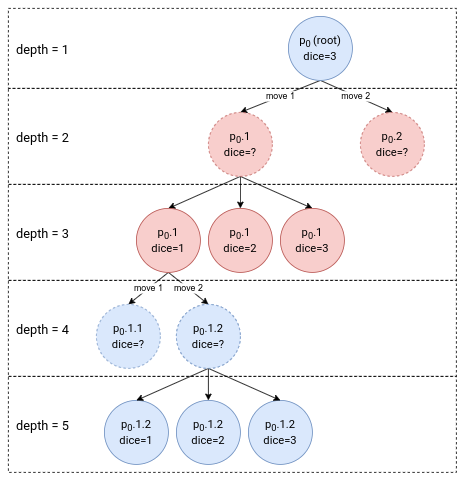

# TCG2023 Final Project Report

b09902004 資工四 郭懷元

## How to Compile

Use this command to compile `agent`:

```bash
make
```

---

## Algorithms & Heuristics

### Game Tree Design

Due to the rules of EWN, I design the game tree to something like this:



An EWN game tree will have alternating layers of deterministic nodes and chance nodes. I also define my search depth to be the depth of that node in the tree, rather than the number of plies.

### Search Algorithm

For game tree searching, I implemented **NegaScout** and **Star1** for deterministic nodes and chance nodes respectively. I mainly followed the pseudo code on course materials, so not much to talk about here.

<div style="page-break-before: always;"></div>

### Evaluation Function

My evaluation function is composed of two parts: `distince_h` and `determinacy_h`.

`distance_h` is defined as the difference of "minimum distance to goal square".

And `determinacy_h` is defined as the difference of "average determinacy of alive pieces", where determinacy is "for how many of the 6 dice outcomes can you move that piece". For example, if one has only piece 1 and 6, the determinacy is 5.

The final score is just `distance_h` + `determinacy_h`.

### Transposition Table Design

Because the game tree always have alternating chance and deterministic layers, it is sufficient to store either chance or deterministic nodes only. I decided to store only chance nodes, since I don't have to consider which pieces are movable in each hash value.

I used 2 arrays of sized $2^{18}$ as the tranposition tables for each color. Each entry contains these values:

```c++
struct tt_entry {
    bool valid{false};
    hash_t hash_key{0};
    score_t position_score{0};
    int depth{-1};
    score_flag_t score_type{k_is_exact};
};
```

For update policy, I simply override the existing entry if the full hash value is different. This is because I keep the same table throughout the game, and I believe that the positions appeared later during the entire process should be more relevant.

---

## Programming

### Precompute

Since a lot of logics like generating moves, calculating distance or heuristics are precomputable and takes up quite little space, I wrote a python script `precompute.py` to generate a header file `precompute.h` with precomputed values. I didn't do detailed benchmarks to see the time saved from each precomputation, but from the experience in HWK1, I think this saves quite some time.

### Comparing Floating Point Numbers

Because the scores at each chance nodes is the expected value among all 6 dice values, the `double` value would need to be divided by 6, and this could cause some unintentional cutoffs due to the limited precision of doubles or some extreme compiler optimization. Therefore when comparing the current lower bound or higher bound to alpha and beta, I only do the cutoff when the value exceeded alpha or beta by a small value $\epsilon = 0.00001$.

### Time Control

For time control, I use iterative deepening with estimated search time.

I first start with a depth of 6, and increase the depth by 2 after each iteration. I use the time for the previous 2 searches ($t_{i-2}, t_{i-1}$) to obtain a estimated scaling factor ($\frac{t_{i-1}}{t_{i-2}}$) of search times. Then I use the expotential average to update the final estimated scaling factor $c_i = s\frac{t_{i-1}}{t_{i-2}} + (1-s) c_{i-1}$.

I would stop searching deeper if the estimated search time for the current depth is larger than the total time left or a pre-defined per-move time limit.

---

## Experiment Results

### Evaluation Function Components

50 games, search depth fixed at 12

| Eval 1       | Eval 2       | Eval 1 Wins | Eval 2 Wins |
| ------------ | ------------ | ----------- | ----------- |
| **Distance** | Determinacy  | **31**      | 19          |
| Distance     | **Combined** | 24          | **26**      |
| Determinacy  | **Combined** | 22          | **28**      |

### Search Depth

50 games, distance + determinacy evaluation

| Depth 1 | Depth 2 | Depth 1 Wins | Depth 2 Wins |
| ------- | ------- | ------------ | ------------ |
| 4       | **12**  | 20           | **30**       |
| 8       | **12**  | 19           | **31**       |
| 4       | **8**   | 21           | **29**       |

### Competition Result

8 round swiss, 30 players

| Games | Wins | Opponent total wins | Final rank |
| ----- | ---- | ------------------- | ---------- |
| 80    | 46   | 360                 | 3          |

---
